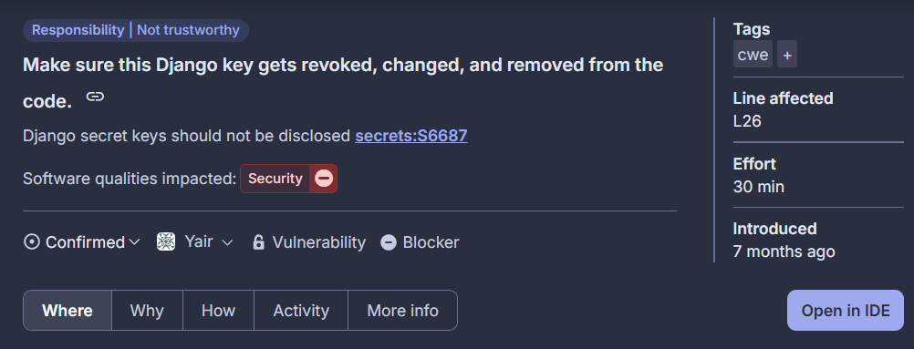
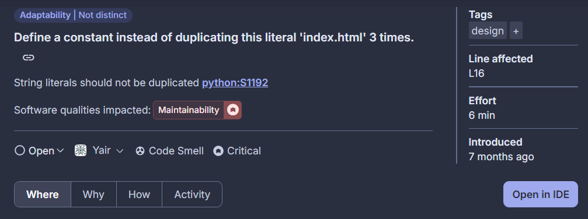

# Inspección
Al realizar la inspección mediante el software Sonarqube se detectarón:
* 1 error grave, el cual tiene relación con la seguridad y trato de datos sensibles.
* 6 errores altos, de los cuales sólo 1 tiene vínculo con HU's/funcionamiento, los demás se tratan de errores encontrados en archivos .js extraídos de plantillas en la librería Bootstrap, todos relacionadas a diseño.
* El resto de errores encontrados tienen un menor nivel de riesgo y al mismo tiempo son en su gran mayoría, al igual que en el punto anterior, errores encontrados en plantillas .css descargadas desde Bootstrap.
## Nivel de severidad: Blocker
### Screenshot:

### Descripción: Las claves secretas de Django no deben ser reveladas
Sector de impacto: Seguridad.
Este mensaje de SonarQube indica que se ha detectado una clave secreta de Django (SECRET_KEY) expuesta directamente en el código fuente(pagina/backend/backend/settings.py). Esta clave es fundamental para la seguridad de una aplicación Django, ya que se utiliza para:

* Firmar cookies de sesión.
* Firmar tokens de seguridad (como CSRF).
* Generar hashes criptográficos internos.

Exponer esta clave puede permitir a un atacante falsificar sesiones, tokens u otras operaciones criptográficamente sensibles dentro de la aplicación, comprometiendo la integridad y seguridad del sistema.
### Recomendaciones hechas por la aplicación:
* Revocar y cambiar la clave inmediatamente si la aplicación está en producción.
* Eliminar la clave del código fuente y moverla a una variable de entorno segura (por ejemplo, usando os.environ.get("SECRET_KEY") en settings.py).
* Revisar el historial del repositorio por exposiciones pasadas (tip: usar git log y git filter-repo o BFG Repo-Cleaner si es necesario).
### Se procede con:
* La encriptación en el código fuente utilizando un archivo .env, contenedor de todas las variables de entorno seguras y locales con las cuales trabajan los desarrolladores.
* Agregar .env o archivos de configuración sensibles a .gitignore para evitar futuros commits accidentales.
* Mejoramiento de HU004.2, donde se hará explícito el uso de variables entornos para mantener la seguridad e integridad de los datos utilizados por los administradores.

## Nivel de severidad: High
### Sreenshot:

### Descripción: Define una constante en lugar de repetir 'index.html' tres veces.
Sector de impacto: Mantenibilidad.
Este mensaje de SonarQube indica que el literal 'index.html' se está utilizando repetidamente (3 o más veces) en el código fuente  (pagina/backend/signup/views.py), sin definirse como una constante reutilizable.

Repetir valores "hardcodeados" (cadenas de texto, números, etc.) viola el principio DRY (Don't Repeat Yourself) y puede generar problemas como:

* Dificultad de mantenimiento: Si el nombre del archivo cambia, se deben buscar y modificar múltiples lugares.
* Mayor riesgo de errores: Una instancia podría olvidarse o escribirse mal (por ejemplo, 'index.html').
* Poca claridad semántica: Repetir el mismo string oculta su intención real (¿es una plantilla base? ¿una vista inicial?).
### Recomendaciones hechas por la aplicación:
* Definir una constante descriptiva en la parte superior del archivo o en un archivo de configuración (si aplica).
* Reemplazar las apariciones del literal con esa constante.
### Se procede con:
* Se define globalmente la variable INDEX_TEMPLATE la cual hace referencia a la planilla .html del index (la pagina principal)
* Se intercambia cada llamado a esta por su respectiva variable definida con la constante.
* En este caso no se considera un mejoramiento de la HU002: Iniciar sesión, pues no hay modificaciones respecto a la estructura ni funcionamiento como tal de la función, el problema estaba más dirigido al uso de malas prácticas en coding.