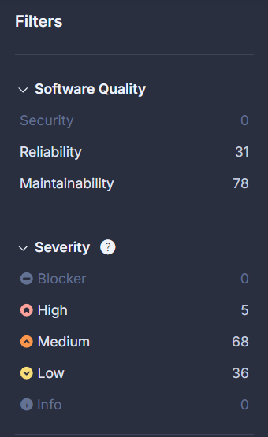

# Re-inspección
Post primer análisis se realizaron las acciones recomendadas por la aplicación, definidos en la sección INSPECTIONS.MD.

Se vuelve a realizar un análisis automático por parte del software al detectear un push a la rama main. Los resultados obtenidos son los siguientes:

## Se logra observar:
* Se resuelve el error de mayor prioridad y severidad, el filtro muestra que no se encuentra ningún error de dichas características.
* Se resuelve el error de nivel alto, vinculado con las malas prácticas de coding adoptadas por el equipo en el módulo de registros de usuarios. Se observa así mismo como los 5 problemas restantes son los ya comentados, en la sección INSPECTIONS.MD, relacionados con errores menores de diseño encontrados en archivos .js en la sección de plantillas obtenidas desde la librería Boostrap.
* El resto de errores vinculados con mantenibilidad y fiabilidad siguen el mismo camino que los del punto anterior, errores menores generados por bloques de comentarios, mayúsculas mal puestas, orden de código, etc.
## Se procede con:
* La modificación y actualización de la única historia de usuario involucrada HU004.2.
